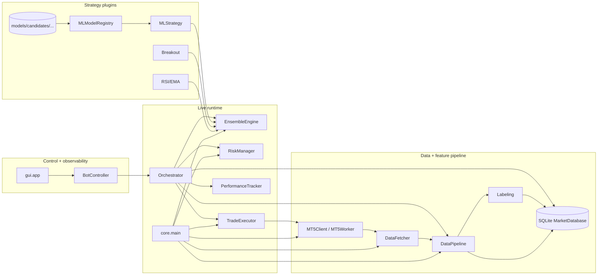
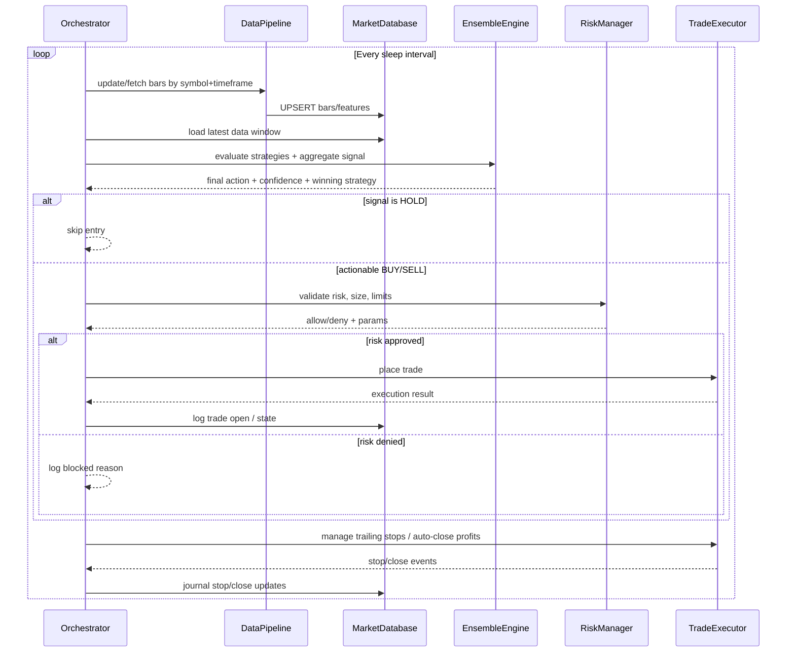
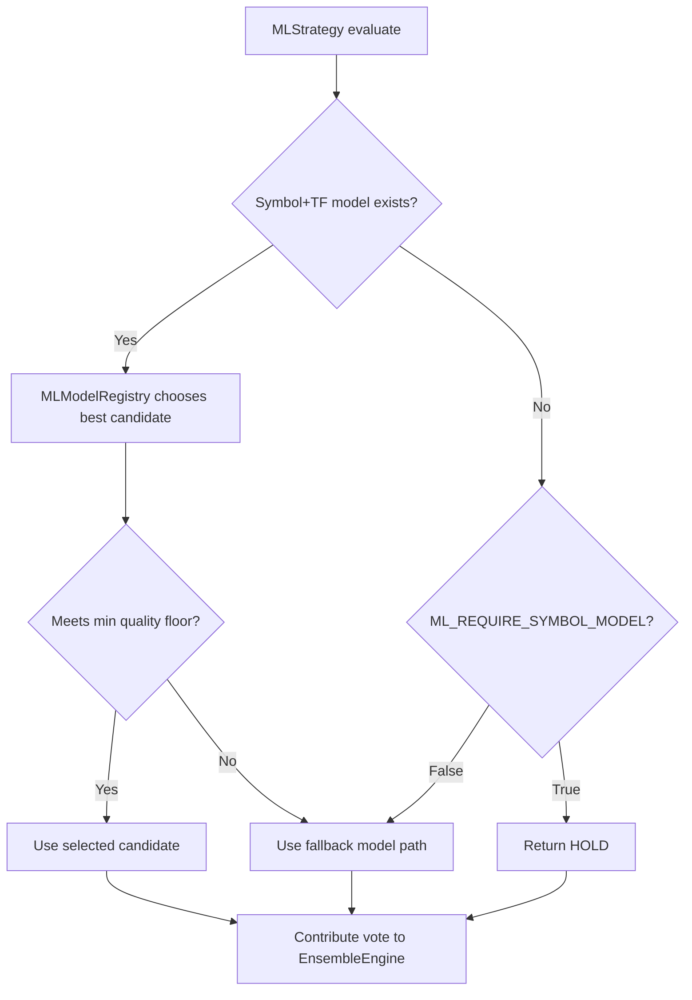
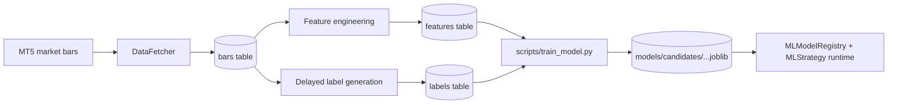

# System Architecture Diagrams

These diagrams provide a visual map of how the trading system is structured and what happens during each execution loop.

## 1) High-level architecture

## 2) Decision cycle (what happens in each loop)

## 3) ML model selection path

## 4) Data lifecycle

## Reading tip

If you are new to the codebase, read in this order:
1. `core/main.py` (wiring)
2. `core/orchestrator.py` (runtime loop)
3. `core/data_pipeline.py` + `core/database.py` (state + persistence)
4. `core/ensemble.py` and `strategies/*` (decision logic)
5. `risk_manager.py` + `trade_executor.py` (execution and safety)
