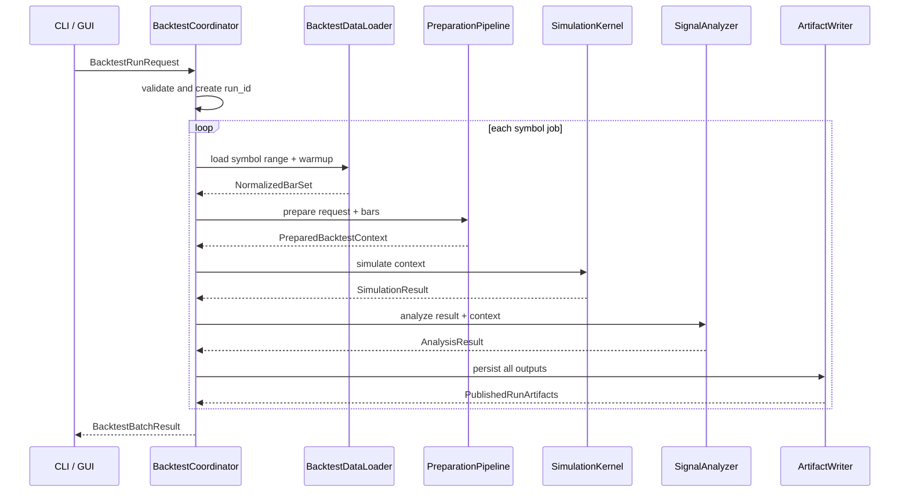

# Backtest Engine Functional Specification

**Document status:** Proposed for implementation  
**Source design:** [`backtest_engine_redesign.md`](backtest_engine_redesign.md)  
**System:** TradLab backtesting subsystem  
**Version:** 1.0  
**Primary users:** strategy developer, quantitative analyst, and trading-system operator

## 1. Purpose

This document translates the architectural redesign into implementable, testable system behavior. It defines what the redesigned engine must do, the interfaces between its components, the result contracts it must preserve, and the acceptance criteria required to replace the legacy engine.

The implementation objective is not merely to make the existing loop faster. The objective is to create a reproducible backtest product whose loading, preparation, simulation, analysis, and persistence stages are independently testable and observable.

Normative terms have their usual meaning:

- **MUST / MUST NOT:** required for acceptance.
- **SHOULD / SHOULD NOT:** expected unless a documented technical reason prevents it.
- **MAY:** optional behavior.

## 2. Scope

### 2.1 In scope

- CLI- and GUI-launched historical backtests.
- SQLite and in-memory/CSV historical-bar inputs.
- Multiple timeframes aligned to a primary decision timeframe.
- Existing rule-based and ML-backed strategies.
- Ensemble aggregation, risk assessment, and deterministic broker simulation.
- Signal scoring, metrics, diagnostic artifacts, and experiment logging.
- Single-symbol execution and controlled parallel execution across symbols.
- Legacy compatibility, semantic comparison, progress reporting, and cancellation.

### 2.2 Out of scope

- Modifying strategy rules or ensemble math.
- Retraining or automatically promoting ML models.
- Live order placement.
- Tick-level simulation.
- Distributed backtesting across multiple hosts.
- Parameter optimization and walk-forward orchestration.
- Replacing SQLite.

## 3. Success criteria

The redesigned engine is functionally acceptable when all of the following are true:

1. Existing supported strategies can run through the prepared strategy interface.
2. Results are deterministic for the same request, input bars, model, engine version, and seed.
3. No decision observes a candle or feature that was unavailable at its decision time.
4. Compatibility fixtures produce semantically equivalent strategy decisions, ensemble decisions, risk outcomes, fills, and metrics.
5. Runtime and memory meet the budgets in Section 20.
6. CLI operation does not require MetaTrader when timeframe mappings and symbol metadata are supplied.
7. A completed run can be audited using only its manifest and artifacts.
8. A failed or cancelled run cannot be mistaken for a completed run.

## 4. Actors and use cases

### 4.1 Actors

| Actor | Need |
|---|---|
| Strategy developer | Run one strategy quickly, inspect decisions, and compare legacy behavior |
| Quantitative analyst | Run reproducible date ranges and analyze signals and fills |
| Operator | Launch multiple symbols, monitor progress, cancel jobs, and inspect failures |
| Maintainer | Add features/strategies without putting historical scans in the hot loop |
| Test runner | Execute deterministic fixtures without GUI, SQLite, or MetaTrader dependencies |

### 4.2 Primary use cases

#### UC-01: Run a single-symbol backtest

1. User supplies symbol, primary timeframe, timeframes, range, strategies, risk, broker, analysis, and output options.
2. System validates and normalizes the request.
3. System loads the requested data plus effective warmup.
4. System prepares all required causal inputs.
5. System simulates decisions and fills.
6. System analyzes signals and writes artifacts.
7. System reports completion with run ID, metrics, warnings, and artifact directory.

#### UC-02: Run multiple symbols

1. User submits one request containing multiple symbols and a worker limit.
2. Coordinator creates one isolated symbol job per symbol.
3. Jobs execute concurrently up to the configured limit.
4. Failure of one symbol is reported independently.
5. Coordinator produces an aggregate result containing every symbol status.

#### UC-03: Compare legacy and optimized engines

1. User selects `compare` mode.
2. Both engines consume equivalent normalized input and configuration.
3. System compares decisions and state transitions by timestamp.
4. System writes a structured difference report.
5. Run fails compatibility acceptance when a non-tolerated difference exists.

#### UC-04: Cancel a run

1. User requests cancellation through CLI signal, API token, or GUI control.
2. Coordinator stops dispatching queued symbols.
3. Active kernels observe cancellation at their next checkpoint.
4. Temporary output is finalized as cancelled or removed according to retention policy.
5. No cancelled run is published as complete.

## 5. Functional architecture



## 6. Public request contract

### 6.1 `BacktestRunRequest`

The canonical request MUST be an immutable dataclass or equivalent validated structure.

```python
@dataclass(frozen=True, slots=True)
class BacktestRunRequest:
    symbols: tuple[str, ...]
    timeframes: tuple[int, ...]
    primary_timeframe: int
    start_time_s: int | None
    end_time_s: int | None
    warmup_bars: int
    starting_cash: float
    symbol_metadata: Mapping[str, SymbolMetadata]
    strategies: tuple[StrategySelection, ...]
    ensemble: EnsembleConfig
    risk: RiskConfig
    broker: BrokerConfig
    analysis: AnalysisConfig
    output: OutputConfig
    execution: ExecutionConfig
    engine_mode: Literal["legacy", "optimized", "compare"] = "optimized"
    random_seed: int = 0
    tag: str = ""
```

### 6.2 Supporting request types

```python
@dataclass(frozen=True, slots=True)
class SymbolMetadata:
    point_size: float
    minimum_lot: float = 0.0

@dataclass(frozen=True, slots=True)
class StrategySelection:
    name: str
    enabled: bool
    weight: float
    parameters: Mapping[str, JSONScalar]

@dataclass(frozen=True, slots=True)
class AnalysisConfig:
    signal_horizons: tuple[int, ...] = (1, 3, 6, 12)
    signal_targets: tuple[int, ...] = (50, 100, 250, 500)

@dataclass(frozen=True, slots=True)
class OutputConfig:
    root_directory: Path
    detail_level: Literal["summary", "signals", "full"] = "signals"
    diagnostics_format: Literal["parquet", "csv"] = "parquet"
    equity_curve_stride: int = 1
    retain_failed_temporary_files: bool = False

@dataclass(frozen=True, slots=True)
class ExecutionConfig:
    max_workers: int = 1
    fail_fast: bool = False
    progress_interval_bars: int = 1_000
    prediction_batch_size: int = 8_192
```

Existing ensemble, risk, and broker settings MUST be represented without loss. During migration, adapters MAY construct the canonical request from existing CLI arguments and GUI widgets.

### 6.3 Request validation requirements

| ID | Requirement |
|---|---|
| FR-REQ-001 | The system MUST reject an empty symbol list. |
| FR-REQ-002 | Symbols and timeframes MUST be deduplicated without changing first-seen order; strict mode MUST reject duplicates instead. |
| FR-REQ-003 | `primary_timeframe` MUST occur in `timeframes`. |
| FR-REQ-004 | The end time MUST be greater than or equal to the start time. |
| FR-REQ-005 | Warmup, worker count, progress interval, batch size, horizons, targets, and equity stride MUST be positive. |
| FR-REQ-006 | Every requested symbol MUST have a positive point size. |
| FR-REQ-007 | Strategy names and parameters MUST be validated before data loading. |
| FR-REQ-008 | The normalized request MUST be serializable into the run manifest. |
| FR-REQ-009 | Unknown fields MUST be rejected by strict CLI/config parsing. |

## 7. Run identity and lifecycle

### 7.1 Run ID

The coordinator MUST generate a collision-resistant run ID containing a UTC timestamp and random or content-derived suffix. A user-supplied display tag MUST NOT replace the run ID.

### 7.2 Status model

```text
QUEUED -> LOADING -> PREPARING -> SIMULATING -> ANALYZING -> PERSISTING -> COMPLETED
                \-> FAILED
                \-> CANCELLING -> CANCELLED
```

Each transition MUST include a timestamp. `COMPLETED`, `FAILED`, and `CANCELLED` are terminal. A symbol job and its parent batch have separate statuses.

### 7.3 Required status result

```python
@dataclass(frozen=True, slots=True)
class SymbolRunResult:
    run_id: str
    symbol: str
    status: RunStatus
    metrics: BacktestMetrics | None
    artifacts: Mapping[str, Path]
    warnings: tuple[RunWarning, ...]
    error: RunError | None
    phase_timings_s: Mapping[str, float]
```

## 8. Data loading requirements

| ID | Requirement |
|---|---|
| FR-DATA-001 | SQLite queries MUST filter by symbol, timeframe, and requested time bounds. |
| FR-DATA-002 | The loader MUST prepend enough earlier rows to satisfy effective warmup. |
| FR-DATA-003 | A limit, when configured, MUST be applied predictably after determining the requested range and warmup behavior. |
| FR-DATA-004 | Returned bars MUST be ascending by open timestamp. |
| FR-DATA-005 | The loader MUST support SQLite and injected in-memory frames; CSV support SHOULD remain available. |
| FR-DATA-006 | Database connections MUST be owned by one worker and closed after loading. |
| FR-DATA-007 | Read operations MUST NOT mutate database schema or data. |
| FR-DATA-008 | Loaded row counts and actual min/max timestamps MUST be reported per timeframe. |
| FR-DATA-009 | Missing primary data MUST fail the symbol job. |
| FR-DATA-010 | Missing non-primary data MUST fail only when required by an enabled strategy or model. |

### 8.1 Effective warmup

The preparation planner MUST calculate:

```text
effective_warmup_bars = max(
  requested_warmup_bars,
  all enabled feature lookbacks,
  regime lookback,
  ML lookback,
  strategy lookbacks expressed on the primary clock
)
```

Both requested and effective warmup MUST appear in the manifest. Warmup rows MUST be available for calculation but MUST NOT create reported decisions, signals, or trades.

## 9. Normalization and data quality

| ID | Requirement |
|---|---|
| FR-NORM-001 | Required columns are `time`, `open`, `high`, `low`, and `close`. |
| FR-NORM-002 | Time MUST normalize to signed 64-bit Unix seconds in UTC. |
| FR-NORM-003 | OHLC values MUST normalize to finite floating-point values. |
| FR-NORM-004 | Open timestamps MUST be strictly increasing after duplicate handling. |
| FR-NORM-005 | Duplicate policy MUST be explicit: `error`, `keep_first`, or `keep_latest`. |
| FR-NORM-006 | Rows with invalid required values MUST fail by default; a drop policy MAY be configured and recorded. |
| FR-NORM-007 | Negative spread MUST be rejected; missing spread MAY use the configured fallback. |
| FR-NORM-008 | The system MUST compute each row's expected close time from its timeframe. |
| FR-NORM-009 | Gaps MUST be detected and summarized without inventing candles. |
| FR-NORM-010 | Normalization MUST produce identical results for equivalent SQLite, CSV, and in-memory inputs. |

## 10. Feature planning and preparation

### 10.1 Feature definition contract

```python
@dataclass(frozen=True, slots=True)
class FeatureDefinition:
    name: str
    version: int
    timeframe: int | Literal["primary"]
    dependencies: tuple[str, ...]
    lookback_bars: int
    dtype: str
    compute: Callable[[FeatureComputeContext], NDArray]
```

Feature names MUST be unique within their timeframe and version. Cyclic dependencies MUST fail planning. The plan MUST include only the transitive dependency closure required by enabled strategies, regime detection, risk, analysis, and ML.

### 10.2 Preparation requirements

| ID | Requirement |
|---|---|
| FR-PREP-001 | Each planned feature MUST be computed at most once per symbol/timeframe/run. |
| FR-PREP-002 | Regime numeric values and labels MUST be precomputed for all eligible primary rows. |
| FR-PREP-003 | H1/H4 context MUST be computed on its native timeframe and causally aligned to the primary clock. |
| FR-PREP-004 | Feature arrays MUST have stable dtype and length documented by their definitions. |
| FR-PREP-005 | Prepared arrays MUST be treated as immutable by simulation and strategies. |
| FR-PREP-006 | Missing values caused by warmup MUST remain explicit until handled by the consuming contract. |
| FR-PREP-007 | Preparation MUST emit timing and memory/size measurements by feature family. |
| FR-PREP-008 | Preparation MUST be deterministic and independent of output detail level. |
| FR-PREP-009 | Labels, future returns, and post-simulation values MUST be prohibited feature dependencies. |

### 10.3 Causal timeframe alignment

For a primary decision at `decision_time_s`, a non-primary candle is available only when:

```text
source_open_time_s + source_timeframe_duration_s <= decision_time_s
```

The alignment result for timeframe `tf` MUST be an integer array with one entry per primary row. Each entry contains the latest eligible source index or `-1`. Exact close-time equality is eligible; a still-open candle is not.

## 11. ML functional requirements

| ID | Requirement |
|---|---|
| FR-ML-001 | The system MUST resolve the ML bundle once per symbol/timeframe job. |
| FR-ML-002 | Candidate selection behavior MUST remain compatible with configured quality and fallback policies. |
| FR-ML-003 | The bundle's symbol, timeframe, feature version, feature ID, schema, and class mapping MUST be validated before simulation. |
| FR-ML-004 | Model file checksum and resolved path MUST be recorded. |
| FR-ML-005 | Feature columns MUST be supplied in exact bundle-declared order. |
| FR-ML-006 | Predictions SHOULD be produced in batches before simulation. |
| FR-ML-007 | Changing prediction batch size MUST NOT change signals or confidence beyond numeric tolerance. |
| FR-ML-008 | Strict mode MUST fail the job on resolution, schema, or prediction error. |
| FR-ML-009 | Permissive HOLD-on-error behavior MUST require explicit configuration and emit a warning. |
| FR-ML-010 | ML prediction arrays MUST be indexed on the same primary clock as other strategy inputs. |

## 12. Prepared strategy contract

### 12.1 Interfaces

```python
class StrategyDefinition(Protocol):
    name: str

    def requirements(self, config: Mapping[str, JSONScalar]) -> StrategyRequirements: ...

    def prepare(
        self,
        context: StrategyPreparationContext,
        config: Mapping[str, JSONScalar],
    ) -> PreparedStrategy: ...

class PreparedStrategy(Protocol):
    name: str

    def is_active(self, index: int) -> bool: ...

    def evaluate(self, index: int) -> StrategyDecision: ...
```

### 12.2 Requirements

| ID | Requirement |
|---|---|
| FR-STRAT-001 | `requirements()` MUST declare timeframes, features, fixed windows, and configuration schema. |
| FR-STRAT-002 | `prepare()` MAY bind array references but MUST NOT modify them. |
| FR-STRAT-003 | `evaluate(index)` MUST return signal, confidence, reason code, and typed optional diagnostics. |
| FR-STRAT-004 | Confidence MUST be finite and within `[0, 1]`. |
| FR-STRAT-005 | Strategy exceptions MUST fail the symbol job by default and identify strategy and index. |
| FR-STRAT-006 | The evaluation path MUST NOT perform I/O, model loading, DataFrame creation/copying, or unbounded history scans. |
| FR-STRAT-007 | Disabled or regime-filtered strategies MUST have distinguishable reason codes. |
| FR-STRAT-008 | A legacy adapter MAY be used during migration and MUST mark the run manifest. |

## 13. Ensemble behavior

The optimized ensemble MUST preserve current semantic behavior:

1. Evaluate each enabled strategy in deterministic request order.
2. Apply strategy activity/regime gating.
3. Obtain the configured base weight.
4. Apply trend and volatility multipliers.
5. Ignore HOLD and confidence below ensemble minimum confidence.
6. Accumulate signed weighted confidence.
7. Calculate normalized vote gap.
8. Return HOLD if total eligible weight is zero, vote gap is below threshold, or net score is effectively zero.
9. Otherwise select BUY for positive score and SELL for negative score.

| ID | Requirement |
|---|---|
| FR-ENS-001 | Strategy iteration order MUST be deterministic. |
| FR-ENS-002 | Effective weight and gating reason MUST be available in full diagnostics. |
| FR-ENS-003 | Optimized and legacy confidence calculations MUST match within configured tolerance. |
| FR-ENS-004 | The final decision MUST be collected once per primary timestamp, not duplicated per strategy output. |

## 14. Simulation and broker behavior

### 14.1 Required event sequence

For every eligible primary index, the kernel MUST perform this sequence:

1. Fill or cancel the prior pending order at the current open.
2. Read prepared strategy and regime inputs for the current decision.
3. Evaluate strategies and ensemble.
4. Attach the current regime to the final decision.
5. Assess risk for actionable decisions using the next open as the proposed entry price.
6. Apply broker new-trade guards.
7. Queue an approved order.
8. Process current high, low, close, stops, targets, trailing stops, and equity.
9. Emit configured events and progress.

### 14.2 Kernel requirements

| ID | Requirement |
|---|---|
| FR-SIM-001 | Decisions MUST begin only after effective warmup. |
| FR-SIM-002 | The last decision index MUST leave a next bar available for execution. |
| FR-SIM-003 | The hot loop MUST perform no database, filesystem, JSON, or model operations. |
| FR-SIM-004 | The hot loop MUST perform no rolling/expanding calculation or unbounded history scan. |
| FR-SIM-005 | Primary OHLC/time/spread access MUST use prepared arrays. |
| FR-SIM-006 | Risk, session, weekend, blocked-symbol, spread, lot, SL/TP, slippage, and trailing behavior MUST remain configurable. |
| FR-SIM-007 | One job MUST own its broker, strategies, collectors, and mutable simulation state. |
| FR-SIM-008 | Seeded random behavior, if later introduced, MUST use the request seed and be recorded. |
| FR-SIM-009 | Cancellation MUST be checked at least every configured progress interval. |

## 15. Result collection

### 15.1 Detail levels

| Level | Required records |
|---|---|
| `summary` | manifest, phase metrics, trading metrics, fills, signal summary |
| `signals` | summary plus actionable per-strategy signals, final decisions, and signal results |
| `full` | signals plus HOLD decisions and all declared typed diagnostics |

Output detail MUST NOT affect trading decisions, fills, metrics, or signal analysis.

### 15.2 Collector requirements

| ID | Requirement |
|---|---|
| FR-COLL-001 | Final ensemble decisions MUST have a dedicated typed record. |
| FR-COLL-002 | Static names and schemas MUST be stored once, using IDs in repeated rows. |
| FR-COLL-003 | Full diagnostics MUST use typed columns where declared. |
| FR-COLL-004 | Arbitrary JSON MUST be optional and MUST exclude repeated static configuration. |
| FR-COLL-005 | High-volume rows MUST flush in bounded chunks. |
| FR-COLL-006 | Online metrics SHOULD use accumulators instead of retaining source dictionaries. |
| FR-COLL-007 | Collector flush boundaries MUST NOT affect output semantics. |

## 16. Signal analysis

| ID | Requirement |
|---|---|
| FR-AN-001 | Only BUY and SELL signals are scored. |
| FR-AN-002 | Per-strategy and final ensemble signals MUST be scored independently. |
| FR-AN-003 | Signal-close and next-open points MUST be calculated for every configured horizon. |
| FR-AN-004 | Correctness is based on positive next-open directional points. |
| FR-AN-005 | MFE and MAE MUST use the largest configured horizon and begin at next open. |
| FR-AN-006 | Target-hit flags and bars-to-target MUST be produced for configured targets. |
| FR-AN-007 | Signals without sufficient future bars MUST use explicit null results. |
| FR-AN-008 | Summary grouping MUST remain by symbol, strategy, and side. |
| FR-AN-009 | Vectorization MUST not alter legacy formulas or boundary behavior. |

## 17. Persistence and manifest

### 17.1 Directory contract

```text
<output-root>/<run-id>/
  batch_manifest.json
  <safe-symbol>/
    manifest.json
    metrics.json
    fills.csv
    equity_curve.csv
    final_signals.csv             # signals/full
    strategy_signals.csv          # signals/full
    signal_results.csv            # signals/full
    signal_summary.csv
    diagnostics.parquet|csv       # full
```

### 17.2 Publication requirements

| ID | Requirement |
|---|---|
| FR-OUT-001 | Output MUST first be written below a temporary run directory. |
| FR-OUT-002 | Completed output MUST be published atomically when supported. |
| FR-OUT-003 | The manifest MUST be written last with terminal status and artifact checksums. |
| FR-OUT-004 | Required artifact write failure MUST fail the symbol job. |
| FR-OUT-005 | Existing completed run directories MUST NOT be overwritten. |
| FR-OUT-006 | Safe symbol names MUST not permit path traversal or collisions without disambiguation. |
| FR-OUT-007 | CSV MUST remain available for compact interoperability artifacts. |
| FR-OUT-008 | Parquet SHOULD be used for full diagnostics and MAY fall back to CSV with a warning. |

### 17.3 Manifest minimum fields

- schema and engine versions;
- run ID, symbol, tag, status, and status timestamps;
- normalized request and effective defaults;
- Git revision and dirty flag;
- runtime/dependency information;
- symbol metadata and timeframe mapping;
- source row counts, time ranges, and checksums;
- data-quality findings and policies;
- effective warmup and feature plan;
- model resolution details and checksum;
- compatibility flags and diff summary;
- phase timings and peak memory when measurable;
- diagnostics counts and warnings;
- artifact relative paths, sizes, and checksums;
- structured failure details when not completed.

## 18. Progress, cancellation, and concurrency

### 18.1 Progress event

```python
@dataclass(frozen=True, slots=True)
class BacktestProgress:
    run_id: str
    symbol: str
    phase: RunPhase
    completed_units: int
    total_units: int | None
    elapsed_s: float
    estimated_remaining_s: float | None
    message: str = ""
```

### 18.2 Coordinator requirements

| ID | Requirement |
|---|---|
| FR-COORD-001 | Multi-symbol execution MUST use isolated processes, not shared mutable strategy/broker state. |
| FR-COORD-002 | Active jobs MUST never exceed `max_workers`. |
| FR-COORD-003 | Default worker count MUST be conservative and memory-aware. |
| FR-COORD-004 | One symbol failure MUST not fail other symbols unless `fail_fast` is true. |
| FR-COORD-005 | Progress callbacks MUST be rate-limited and thread/process safe. |
| FR-COORD-006 | Cancellation MUST prevent queued jobs from starting. |
| FR-COORD-007 | Results MUST be presented in deterministic request-symbol order regardless of completion order. |
| FR-COORD-008 | Worker count MUST not change per-symbol results. |

## 19. CLI and GUI behavior

### 19.1 CLI

The existing script path SHOULD remain as a compatibility entry point. It MUST translate arguments into `BacktestRunRequest` and invoke the coordinator. New arguments MUST include:

```text
--engine-mode legacy|optimized|compare
--max-workers N
--output-detail summary|signals|full
--diagnostics-format parquet|csv
--prediction-batch-size N
--progress-interval-bars N
--duplicate-policy error|keep_first|keep_latest
--fail-fast true|false
```

The CLI MUST return zero only when all requested symbol jobs complete successfully. Partial failure MUST return nonzero and still print successful artifact locations. Machine-readable JSON status SHOULD be available.

### 19.2 GUI

The Backtest tab MUST:

- create the same canonical request as the CLI;
- expose engine mode, worker count, and output detail;
- display per-symbol phase and progress;
- support cancellation;
- show success, partial failure, failure, and cancellation distinctly;
- display warnings and open the immutable run directory;
- estimate requested bar volume and warn about full diagnostic size;
- avoid requiring an MT5 connection when symbol metadata is already supplied.

## 20. Non-functional requirements

### 20.1 Performance

| ID | Requirement |
|---|---|
| NFR-PERF-001 | Increasing a representative 10k-bar run to 20k bars MUST increase runtime by no more than 2.5×. |
| NFR-PERF-002 | A 20k-bar optimized rule-strategy run MUST be at least 5× faster than legacy on the reference host. |
| NFR-PERF-003 | A 20k-bar optimized ML run MUST be at least 3× faster than legacy on the reference host. |
| NFR-PERF-004 | A 200k-primary-bar `signals` run MUST remain below 1 GB peak resident memory on the reference host. |
| NFR-PERF-005 | Progress reporting overhead MUST remain below 1% of runtime. |

### 20.2 Determinism and numerical behavior

| ID | Requirement |
|---|---|
| NFR-DET-001 | Repeating the same run MUST produce identical categorical events and timestamps. |
| NFR-DET-002 | Floating-point compatibility tolerance MUST be explicit per field; default absolute tolerance is `1e-12` unless the algorithm requires another documented value. |
| NFR-DET-003 | Output format, batching, chunking, and worker count MUST not affect simulation results. |

### 20.3 Maintainability and portability

| ID | Requirement |
|---|---|
| NFR-MAIN-001 | Core preparation and simulation MUST be importable without PySide or MetaTrader. |
| NFR-MAIN-002 | Unit tests MUST accept injected bars and stub models. |
| NFR-MAIN-003 | New strategies MUST declare dependencies rather than directly compute unbounded histories. |
| NFR-MAIN-004 | Public result and manifest schemas MUST carry versions. |

## 21. Compatibility specification

### 21.1 Compare-mode record

```python
@dataclass(frozen=True, slots=True)
class CompatibilityDifference:
    symbol: str
    time_s: int
    component: str
    field: str
    legacy_value: JSONValue
    optimized_value: JSONValue
    tolerance: float | None
    severity: Literal["warning", "failure"]
```

### 21.2 Required comparison points

- regime labels, ADX, ATR percentage, and slope;
- each strategy's signal, confidence, activity, and reason;
- ensemble signal, confidence, vote gap, and score;
- risk approval, quantity, stop, and target;
- broker pending order and position transitions;
- fill time, side, quantity, price, and reason;
- cash, equity, diagnostics counters, and final metrics.

Compatibility MUST compare semantic records, not CSV byte representation. Any waived difference MUST identify its requirement, rationale, owner, and expiration milestone.

## 22. Acceptance scenarios

### AS-01: Higher-timeframe candle is not exposed early

**Given** M5 is primary and an H1 candle opens at 10:00,  
**When** decisions occur from 10:05 through 10:55,  
**Then** the 10:00 H1 candle is unavailable,  
**And when** the decision occurs at 11:00,  
**Then** that H1 candle becomes available.

### AS-02: Warmup does not trade

**Given** effective warmup is 220 bars,  
**When** a strategy would emit BUY on bar 219,  
**Then** no decision, signal result, order, or fill is reported for that bar.

### AS-03: Next-open execution

**Given** a BUY decision on primary bar `i`,  
**When** risk and broker guards approve it,  
**Then** the order is queued after the decision,  
**And** it can fill no earlier than the open of bar `i + 1` using configured spread and slippage.

### AS-04: Future perturbation

**Given** a completed deterministic fixture,  
**When** OHLC values after time `T` are replaced,  
**Then** every strategy, ensemble, risk, and broker result at or before `T` remains unchanged.

### AS-05: Batched ML equivalence

**Given** the same prepared matrix and bundle,  
**When** predictions use batch sizes 1, 128, and 8192,  
**Then** classes are identical and confidences match within tolerance.

### AS-06: Detail-level independence

**Given** the same request except for output detail,  
**When** `summary`, `signals`, and `full` runs complete,  
**Then** fills, equity, final signals, and metrics are identical.

### AS-07: Multi-worker independence

**Given** the same multi-symbol request,  
**When** it runs with one worker and then with multiple workers,  
**Then** each symbol's semantic outputs are identical.

### AS-08: Atomic failure

**Given** artifact persistence fails before manifest completion,  
**Then** no final directory is marked completed,  
**And** a structured failure status is returned.

### AS-09: Range-aware loading

**Given** a database containing years of data and a one-month requested range,  
**When** the loader executes,  
**Then** it reads only the month, necessary effective warmup, and no later rows.

### AS-10: Missing required timeframe

**Given** an enabled strategy requires H1 data,  
**And** no H1 rows exist,  
**When** preparation runs,  
**Then** the symbol job fails before simulation with a structured missing-data error.

## 23. Test deliverables

Implementation is incomplete without:

1. Unit tests for validation, loading, normalization, feature planning, alignment, ML batching, strategies, ensemble, broker ordering, analysis, and persistence.
2. Future-perturbation and worker/batch/chunk invariance tests.
3. Golden datasets for RSI/breakout, Boom, Crash, ML, missing/gapped timeframes, broker filters, and stop/target/trailing behavior.
4. A benchmark command producing machine-readable phase timing and memory results.
5. A compare-mode report exercised in CI on compact fixtures.
6. A CLI smoke test that runs without PySide or MetaTrader.

## 24. Implementation work breakdown

### Milestone 1: foundation

- Add request/result/status dataclasses and validation.
- Add timeframe mapping independent of MetaTrader imports.
- Add phase timing, run IDs, structured errors, and manifests.
- Refactor SQLite loading to be range-aware and read-only.
- Add normalized in-memory input support.

**Completion gate:** FR-REQ, FR-DATA, and FR-NORM tests pass; legacy simulation can consume loaded frames.

### Milestone 2: preparation

- Add feature registry and dependency planner.
- Move current shared features and regime calculations into vectorized definitions.
- Add effective-warmup calculation.
- Add causal index maps and H1/H4 prepared context.

**Completion gate:** FR-PREP and AS-01/02/04 pass against golden fixtures.

### Milestone 3: optimized kernel and rule strategies

- Add prepared strategy interfaces.
- Port RSI/EMA, breakout, RSI3/MA, Boom, and Crash strategies.
- Add array-backed ensemble and kernel.
- Add semantic compare mode.

**Completion gate:** rule-strategy compatibility and NFR-PERF-001/002 pass.

### Milestone 4: ML and analysis

- Add one-time model resolution/schema validation.
- Add batch prediction arrays.
- Vectorize horizon and MFE/MAE calculations.

**Completion gate:** FR-ML, FR-AN, AS-05, and NFR-PERF-003 pass.

### Milestone 5: outputs and orchestration

- Add typed chunked collectors and detail levels.
- Add atomic artifact publishing.
- Add process-based coordinator, progress, and cancellation.
- Integrate canonical requests into CLI and GUI.

**Completion gate:** FR-COLL, FR-OUT, FR-COORD, AS-06/07/08, and memory budget pass.

### Milestone 6: rollout

- Run compare mode over representative stored histories.
- Resolve or explicitly waive every semantic difference.
- Make optimized mode the default.
- Retain legacy mode for one release cycle, then remove it.

**Completion gate:** all success criteria are met and operational documentation is updated.

## 25. Requirement traceability

| Design concern | Functional coverage | Acceptance coverage |
|---|---|---|
| Broad database loads | FR-DATA-001–003 | AS-09 |
| Repeated rolling calculations | FR-PREP-001–003, FR-SIM-004 | AS-04, performance tests |
| Growing DataFrame strategy inputs | FR-STRAT-002/006, FR-SIM-005 | compatibility and scaling tests |
| Per-row ML overhead | FR-ML-001–010 | AS-05 |
| Look-ahead risk | FR-PREP-003/009, causal alignment | AS-01, AS-04 |
| Large diagnostic artifacts | FR-COLL-001–007 | AS-06, memory tests |
| Serial symbols | FR-COORD-001–008 | AS-07 |
| Partial/corrupt outputs | FR-OUT-001–005 | AS-08 |
| Semantic migration risk | Section 21 | UC-03 and golden tests |
| Environment coupling | NFR-MAIN-001/002 | CLI smoke test |

## 26. Open product decisions

These decisions do not block Milestones 1–3 but MUST be resolved before Milestone 5:

1. Whether Parquet becomes required or remains an optional optimized format.
2. Maximum default memory allowance per worker.
3. Retention duration for failed temporary directories and full diagnostics.
4. Whether strict duplicate handling is the universal default.
5. Whether the GUI retains compare mode after legacy retirement.
6. Whether permissive ML HOLD-on-error is exposed in the GUI or CLI only.

## 27. Definition of ready for implementation

Engineering may begin when:

- this functional specification and the source redesign are approved;
- open decisions needed for the active milestone are resolved;
- representative golden input datasets are identified;
- a reference performance host or reproducible container is identified;
- current legacy outputs are captured for compatibility testing;
- implementation changes are kept separate from trading-rule changes.

## 28. Definition of done

The redesign is done only when all normative requirements applicable to optimized mode pass, all acceptance scenarios are automated, performance budgets are demonstrated, compare-mode differences are resolved or approved, CLI and GUI use the canonical request, artifacts are reproducible and atomic, and the legacy engine has a documented removal outcome.
