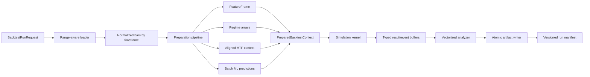

# Backtest Engine Redesign Specification

**Status:** Proposed  
**Audience:** maintainers of the data, strategy, ML, backtest, reporting, and GUI subsystems  
**Primary objective:** make backtest runtime scale approximately linearly with the number of bars while preserving deterministic, look-ahead-safe results  
**Out of scope:** changing trading rules, retraining models, or changing the live order-execution contract

## 1. Executive summary

The current backtest evaluates every primary-timeframe bar by passing each strategy an ever-growing history. Regime detection and several strategies then recalculate rolling indicators, higher-timeframe context, and DataFrame copies over that history. This produces approximately quadratic work for important paths. All-symbol GUI runs compound the delay by running one symbol at a time, and detailed per-bar JSON diagnostics create large memory and CSV costs.

The redesigned engine will separate a backtest into five explicit phases:

1. **Load:** query only the requested interval plus the required warmup.
2. **Prepare:** normalize bars and precompute causal features, regimes, higher-timeframe context, and ML predictions once.
3. **Simulate:** iterate over compact array-backed decision rows and perform only constant-time strategy, ensemble, risk, and broker operations.
4. **Analyze:** vectorize signal scoring and aggregate results after simulation.
5. **Persist:** write a versioned run manifest and compact, configurable artifacts atomically.

The public behavior must remain deterministic and must retain the existing bar-close decision/next-bar-open execution semantics. A compatibility harness will compare legacy and redesigned outputs before the new path becomes the default.

## 2. Problem statement

### 2.1 Current behavior

For each primary bar, the engine determines which bars in every timeframe have closed, creates historical slices, detects the market regime, evaluates every enabled strategy, aggregates votes, applies risk policy, and advances the broker. Strategy metadata is accumulated in memory and later rescored and written to CSV.

This design is logically straightforward but computationally inefficient:

- historical slices grow throughout the run;
- regime indicators are rebuilt for each decision;
- strategy-specific ATR, EMA, Bollinger, and H1/H4 calculations are rebuilt independently;
- higher-timeframe context may be recomputed multiple times for one decision;
- ML schema preparation and inference happen one row at a time;
- signal analysis performs a second Python-level traversal;
- every strategy result, including HOLD, carries repeated JSON metadata;
- multiple symbols are queued serially by the GUI;
- date restrictions are applied after broad database reads.

### 2.2 Desired behavior

For `N` primary bars, `T` timeframes, and `S` strategies, the target computational shape is:

```text
preparation: O(total input bars × feature families)
simulation:  O(N × S)
analysis:    O(N × S + number of actionable signals)
```

No calculation in the simulation loop may scan an unbounded prefix of historical data. A strategy may inspect a fixed-size trailing window only when the rule cannot be represented by a precomputed feature.

## 3. Goals and non-goals

### 3.1 Goals

- Preserve bar-close decisions and next-bar-open fills.
- Prevent look-ahead across all timeframe joins, cached features, and batch predictions.
- Reduce single-symbol runtime materially and make runtime growth close to linear.
- Bound peak memory independently from verbose diagnostic output.
- Support controlled multi-symbol concurrency.
- Make each stage observable and independently benchmarkable.
- Keep strategies testable without a database, GUI, or MetaTrader installation.
- Make result schemas and run configuration explicit and versioned.
- Allow legacy and redesigned engines to coexist during migration.
- Preserve reproducibility from a run manifest and immutable inputs.

### 3.2 Non-goals

- Redesigning strategy entry or exit rules.
- Changing position sizing, spread, slippage, session, trailing-stop, or fill semantics.
- Making one symbol internally multithreaded in the first release.
- Moving away from SQLite as a prerequisite.
- Introducing distributed execution.
- Sharing mutable model or broker instances between processes.
- Guaranteeing byte-identical CSV formatting; semantic equality is required instead.

## 4. Design principles

1. **Causal by construction:** every prepared value records or implies the source candle close time.
2. **Prepare once, read many:** rolling calculations belong in preparation, not simulation.
3. **Hot loops use arrays:** Pandas is used at boundaries and for vectorized preparation, not repeated scalar access.
4. **One canonical clock:** the primary timeframe supplies decision rows; other timeframes are aligned to it.
5. **Pure strategies:** strategy evaluation reads an immutable row/window and returns a result without mutating shared data.
6. **Explicit schemas:** features, diagnostics, artifacts, and manifests carry versions.
7. **Determinism before parallelism:** optimize one run before adding symbol concurrency.
8. **Measure every phase:** performance claims require benchmark evidence.

## 5. Proposed architecture



### 5.1 Modules

The implementation should converge on these responsibilities. Exact filenames may change during implementation, but boundaries must remain clear.

| Component | Responsibility |
|---|---|
| `BacktestRunRequest` | Validated, immutable run configuration |
| `BacktestDataLoader` | Range-aware database/CSV loading and normalization |
| `PreparationPipeline` | Feature planning, vectorized computation, timeframe alignment |
| `FeatureRegistry` | Declares feature dependencies and implementations |
| `PreparedBacktestContext` | Immutable arrays and index maps consumed by simulation |
| `PreparedStrategy` | Constant-time strategy evaluation contract |
| `SimulationKernel` | Decision loop, ensemble, risk, and broker advancement |
| `ResultCollector` | Typed, bounded event and diagnostic buffers |
| `SignalAnalyzer` | Vectorized horizon, correctness, MFE/MAE, and target scoring |
| `ArtifactWriter` | Atomic, versioned persistence |
| `BacktestCoordinator` | Single- and multi-symbol orchestration, progress, cancellation |

## 6. Data contracts

### 6.1 `BacktestRunRequest`

The request must be immutable after validation and contain:

```python
@dataclass(frozen=True)
class BacktestRunRequest:
    run_id: str
    symbols: tuple[str, ...]
    timeframes: tuple[int, ...]
    primary_timeframe: int
    start_time_s: int | None
    end_time_s: int | None
    warmup_bars: int
    starting_cash: float
    strategy_config: StrategyConfig
    ensemble_config: EnsembleConfig
    risk_config: RiskConfig
    broker_config: BrokerConfig
    analysis_config: AnalysisConfig
    output_config: OutputConfig
    engine_version: str
    random_seed: int
```

Validation must reject duplicate timeframes, a primary timeframe absent from `timeframes`, invalid time ranges, non-positive point sizes, unsupported timeframes, empty symbol sets, and conflicting output settings.

### 6.2 Normalized bars

Every timeframe frame must:

- be sorted strictly by `time` ascending;
- contain unique open timestamps;
- use numeric OHLC fields;
- contain `time`, `open`, `high`, `low`, and `close`;
- represent `spread` as nullable points;
- include a computed `close_time_s` based on the timeframe duration;
- carry a data-quality summary covering duplicates, gaps, nulls, and non-monotonic rows.

Normalization must never silently reorder duplicate timestamps with conflicting OHLC values. The configured policy must be `error`, `keep_latest`, or `keep_first`, and the selected policy must be recorded in the manifest.

### 6.3 `PreparedBacktestContext`

The simulation context should expose immutable NumPy arrays:

```python
@dataclass(frozen=True)
class PreparedBacktestContext:
    primary_time_s: NDArray[np.int64]
    decision_time_s: NDArray[np.int64]
    open: NDArray[np.float64]
    high: NDArray[np.float64]
    low: NDArray[np.float64]
    close: NDArray[np.float64]
    spread_points: NDArray[np.float64]
    feature_arrays: Mapping[str, NDArray]
    timeframe_row_index: Mapping[int, NDArray[np.int64]]
    strategy_inputs: Mapping[str, StrategyInputView]
    preparation_metadata: PreparationMetadata
```

`timeframe_row_index[tf][i]` identifies the latest row of timeframe `tf` that was closed at primary decision `i`, or `-1` when unavailable. This replaces growing DataFrame slices.

### 6.4 Strategy result

```python
@dataclass(frozen=True, slots=True)
class StrategyDecision:
    strategy_id: int
    signal: Signal
    confidence: float
    reason_code: int
    diagnostic_values: tuple[float | int | bool | None, ...] = ()
```

Human-readable names and reason strings belong in a schema dictionary written once per run. Repeating them in every row is optional debug behavior, not the default.

## 7. Range-aware data loading

### 7.1 SQL behavior

Time restrictions must be included in the SQLite query:

```sql
SELECT time, open, high, low, close, tick_volume, spread, real_volume
FROM bars
WHERE symbol = ?
  AND timeframe = ?
  AND time >= ?
  AND time <= ?
ORDER BY time ASC;
```

The loader must extend the lower bound far enough to satisfy warmup and the largest declared feature lookback. If an exact lower timestamp cannot guarantee enough bars because of gaps, it may issue a bounded pre-range query for the preceding `required_warmup_bars` rows and combine the results.

### 7.2 Required lookback planning

Each feature and strategy declares its history requirement. The preparation planner calculates:

```text
required warmup = max(
    user warmup,
    regime lookback,
    strategy feature lookbacks,
    ML feature lookbacks,
    higher-timeframe context lookbacks
)
```

The manifest must distinguish user-requested warmup from effective warmup.

### 7.3 Connection behavior

- One database connection per worker process.
- Read-only mode for backtest workers when supported.
- A consistent snapshot for the duration of data loading.
- No shared SQLite connection across processes or threads.
- Query duration and loaded row counts emitted as metrics.

## 8. Preparation pipeline

### 8.1 Feature registry

Features must be registered with stable names, versions, input columns, timeframe scope, output dtype, lookback, and implementation:

```python
FeatureDefinition(
    name="atr_14",
    version=1,
    inputs=("high", "low", "close"),
    lookback=15,
    dtype="float64",
    compute=compute_atr_14,
)
```

The planner computes the union of features required by enabled strategies, the regime detector, risk management, reporting, and the selected ML model. Unused features must not be calculated.

### 8.2 Regime precomputation

ADX, ATR percentage, EMA spread, spread slope, trend label, and volatility label must be produced as full arrays before simulation. The algorithm must match legacy formulas during compatibility mode, including NaN handling and thresholds.

The simulation reads `regime_trend[i]`, `regime_vol[i]`, and numeric values directly. It must not call rolling, EWM, concatenation, or polynomial fitting.

### 8.3 Higher-timeframe alignment

For primary decision time `D` and timeframe duration `F`, a higher-timeframe bar is eligible only when:

```text
higher_timeframe_open_time + F <= D
```

Alignment must be computed with `searchsorted` or an as-of join once per timeframe. Tests must explicitly cover exact boundaries, missing candles, daylight-independent UTC timestamps, and primary bars occurring between higher-timeframe closes.

### 8.4 H1/H4 context

H1 trend, H1 support/resistance, distance/buffer flags, and H4 trend features must be calculated on their native timeframe. Results are forward-filled onto the primary decision clock only after the source candle closes.

Support/resistance may remain window-based, but its work must be bounded by the configured lookback. It must execute once per new H1 row, never once per primary row per strategy.

### 8.5 ML preparation

Before simulation, the ML preparation stage must:

1. Resolve one bundle for the symbol and primary timeframe.
2. Record model path, checksum, model/schema versions, and selection reason.
3. Validate the live feature schema once.
4. Build the complete eligible feature matrix in model-declared column order.
5. Apply the bundle's missing-value policy.
6. Invoke `predict_proba` or `predict` in configurable batches.
7. Store predicted signal and confidence arrays.

Batch size defaults to a memory-safe value and may be configured. Prediction failures must identify the batch range and abort by default; returning HOLD for model errors requires an explicit permissive policy recorded in the manifest.

### 8.6 Cache policy

The first implementation may cache only within one run. A later disk cache may use this key:

```text
hash(symbol, timeframe, min/max source timestamp, source row checksum,
     feature definitions and versions, strategy preparation config,
     model checksum)
```

Cache entries must be immutable and atomically published. A cache hit must never bypass data-quality validation.

## 9. Strategy API redesign

### 9.1 Lifecycle

Strategies receive two lifecycle calls:

```python
prepared = strategy.prepare(preparation_context)
decision = prepared.evaluate(index=i)
```

`prepare()` declares or binds feature arrays. `evaluate()` must perform constant-time indexed reads and bounded arithmetic.

### 9.2 Constraints

An implementation accepted for the optimized engine must not, inside `evaluate()`:

- call Pandas `rolling`, `ewm`, `expanding`, `groupby`, or `merge`;
- copy a DataFrame;
- scan from row zero to the current row;
- load or resolve an ML model;
- access the database or filesystem;
- mutate shared feature arrays;
- depend on wall-clock time or unseeded randomness.

Temporary compatibility adapters may wrap legacy strategies, but runs using them must be labeled `legacy_strategy_adapter=true` and are not expected to meet performance targets.

### 9.3 Feature declaration example

```python
class BoomSpikeTrendDefinition:
    required_features = {
        5: {"atr_14", "close"},
        15: {"atr_14", "atr_50", "bb_width_20", "rsi_14"},
        60: {"trend_50_200", "support_120", "resistance_120"},
        240: {"ema_50"},
    }
```

The planner uses these declarations to load timeframes, determine warmup, and compute only the required columns.

## 10. Simulation kernel

### 10.1 Event order

The event order must remain explicit and covered by tests:

1. At primary bar open, fill or cancel any order queued by the prior decision.
2. Read the current bar and prepared causal context.
3. Evaluate enabled and regime-active strategies.
4. Aggregate the ensemble decision.
5. Assess risk using the next primary open for proposed entry parameters, matching legacy behavior.
6. Queue an approved order when broker guards allow it.
7. Process intrabar stop, target, trailing-stop, and mark-to-market behavior.
8. Record configured events and diagnostics.

The specification intentionally preserves the existing order. Any future change requires a separate semantic version and golden-test update.

### 10.2 Hot-loop requirements

- No DataFrame creation.
- No JSON serialization.
- No file or database I/O.
- No unbounded history scan.
- No model loading or inference after preparation.
- Numeric arrays accessed by integer index.
- Strategy and broker objects local to one run.

### 10.3 Cancellation and progress

The kernel checks a cancellation token at a configurable interval, defaulting to every 1,000 primary bars. Progress events contain run ID, symbol, phase, processed bars, total bars, elapsed time, and estimated remaining time. Progress reporting must be rate-limited and must not serialize full state.

## 11. Results and diagnostics

### 11.1 Output levels

`OutputConfig.detail_level` supports:

| Level | Contents |
|---|---|
| `summary` | manifest, metrics, fills, signal summary |
| `signals` | summary plus actionable strategy/final signals and signal results |
| `full` | all strategy decisions, including HOLD and typed diagnostics |

The GUI default should be `signals`. `full` is intended for debugging and must display an estimated artifact size before the run.

### 11.2 Typed diagnostics

Frequently queried values—reason code, regime, confidence, effective weight, ATR, and key gates—must be typed columns. Arbitrary JSON metadata may remain as an optional extension column but must not repeat static configuration or schema dictionaries.

### 11.3 Bounded collection

Collectors buffer rows in configurable chunks and flush them to temporary artifacts. The simulation must not retain every full-detail result as Python dictionaries. Metrics that can be updated online should use accumulators.

### 11.4 Signal analysis

Horizon results should use vectorized shifted close arrays. Future high/low extrema should use reverse rolling or another tested vectorized algorithm. Only actionable signal indices should be materialized in the result table.

Final ensemble decisions must be collected directly rather than reconstructed from duplicated per-strategy rows.

## 12. Artifact format and reproducibility

### 12.1 Run directory

```text
backtests/runs/<run_id>/<symbol>/
  manifest.json
  metrics.json
  fills.csv
  equity_curve.csv              # optional/downsampled by configuration
  strategy_signals.csv          # signals/full modes
  final_signals.csv             # signals/full modes
  signal_results.csv            # signals/full modes
  signal_summary.csv
  diagnostics.parquet           # optional full mode
```

Parquet is preferred for high-volume diagnostics when the dependency is available. CSV remains the interoperability format for compact outputs.

### 12.2 Manifest

The manifest must include:

- run ID, status, start/end timestamps, and engine version;
- normalized request configuration;
- Git commit and dirty-state flag;
- Python and dependency versions;
- symbol metadata, point size, and timeframe mapping;
- actual source time ranges, counts, and checksums;
- feature and diagnostic schema versions;
- ML bundle path and checksum;
- data-quality summary;
- per-phase duration, peak memory when available, and row counts;
- artifact paths, sizes, checksums, and completion state;
- warnings and compatibility flags.

### 12.3 Atomic publication

Artifacts are first written beneath `<run_id>.tmp`. On success, files are flushed, checksums are recorded, and the directory is atomically renamed. Failed or cancelled runs retain a small failure manifest but must not appear as completed runs.

## 13. Multi-symbol coordinator

### 13.1 Execution model

The coordinator uses a process pool because symbol runs are CPU-heavy and should not share mutable models or brokers. Default concurrency is:

```text
min(available logical CPUs, 2)
```

Users may configure a higher value. A memory estimate must cap concurrency when inputs or models are large.

### 13.2 Scheduling

- One symbol per task.
- Shortest estimated jobs may run first after the first release.
- Each task owns its database connection and output directory.
- Failure of one symbol does not cancel others unless `fail_fast=true`.
- Aggregate status reports succeeded, failed, cancelled, queued, and running counts.

### 13.3 GUI behavior

The GUI must provide:

- worker-count control;
- phase-aware progress for each symbol;
- cancellation of queued and running jobs;
- output-detail selector;
- estimated bar and artifact counts before launch;
- direct links to completed run directories;
- a clear indication when the compatibility engine is selected.

Worker processes must not import GUI modules. Backtest CLI startup must also work without MetaTrader installed when explicit point size and timeframe mappings are available.

## 14. Look-ahead safety requirements

Look-ahead correctness takes precedence over performance.

1. A feature at row `i` may use only row `i` and earlier source rows.
2. Higher-timeframe values become visible only at or after their candle close.
3. ML predictions may be batched, but every row must be generated solely from its causal feature row.
4. Labels and future-return columns must never enter the feature registry.
5. Signal scoring occurs after simulation and cannot influence decisions.
6. Entry fills occur no earlier than the next primary open.
7. Warmup rows may influence features but may not generate trades or reported signals.
8. Tests must perturb future bars and prove earlier decisions do not change.

## 15. Error handling

### 15.1 Fail-fast errors

- Missing primary bars.
- Invalid or non-monotonic normalized timestamps.
- Missing required strategy/model features.
- Model schema or symbol/timeframe mismatch in strict mode.
- Non-positive point size.
- Corrupt cache entry or artifact checksum mismatch.
- Unsupported strategy under optimized-only execution.

### 15.2 Warnings

- Gaps not prohibited by the configured data-quality policy.
- Missing optional spread data with an explicit fallback.
- Requested start shifted because effective warmup is unavailable.
- Parquet unavailable and CSV fallback selected.
- Full diagnostics estimated to exceed a configured threshold.

Warnings must be structured, appear in the manifest, and be surfaced by the CLI and GUI.

## 16. Observability and performance budgets

Every run records duration and row counts for:

- database loading;
- normalization/data-quality checks;
- feature computation by feature family;
- timeframe alignment;
- ML resolution and prediction;
- simulation;
- signal analysis;
- artifact writing.

The following are initial acceptance targets on a documented reference machine and dataset:

| Measure | Target |
|---|---|
| Runtime scaling from 10k to 20k primary bars | no worse than 2.5× |
| Optimized vs legacy, 20k bars, rule strategies | at least 5× faster |
| Optimized vs legacy, 20k bars, ML enabled | at least 3× faster |
| Peak memory, `signals` detail | less than 1 GB for 200k primary bars |
| Repeat determinism | identical decisions, fills, and metrics |
| Progress overhead | below 1% of total runtime |

Targets should be revised only through a documented benchmark change.

## 17. Compatibility and equivalence

### 17.1 Comparison modes

- `legacy`: current engine only.
- `optimized`: redesigned engine only.
- `compare`: run both engines on the same prepared input and generate a semantic diff.

### 17.2 Required comparisons

For every decision timestamp:

- strategy signal and confidence;
- final ensemble signal and confidence;
- regime labels and material numeric regime values;
- risk approval and parameters;
- queued orders;
- fills and reasons;
- cash/equity and open position state.

Floating-point comparisons use documented tolerances; categorical and timestamp values require exact equality. Any intentional formula change must be isolated from the performance migration and approved separately.

## 18. Testing strategy

### 18.1 Unit tests

- Feature calculations against known vectors.
- Required-lookback planning.
- Timeframe alignment at close boundaries.
- H1/H4 context forward-fill behavior.
- Batch ML prediction equivalence to row prediction.
- Strategy evaluation using prepared arrays.
- Broker event ordering and fill semantics.
- Typed diagnostic encoding/decoding.
- Manifest validation and atomic publication.

### 18.2 Property and invariant tests

- Adding future bars cannot change earlier decisions.
- Input row order normalization cannot change valid results.
- Duplicate-time policy behaves exactly as configured.
- Chunk size and ML batch size cannot change outputs.
- Worker count cannot change per-symbol outputs.
- Summary and full detail levels produce identical trading results.

### 18.3 Golden tests

Create small fixtures for:

- one simple RSI/breakout symbol;
- one Boom symbol with all specialized strategies;
- one Crash symbol;
- one ML-enabled symbol with a tiny deterministic model;
- gaps and missing higher-timeframe bars;
- session/weekend/spread filters;
- flip, stop, target, and trailing-stop cases.

Golden fixtures should store input bars and expected semantic results, not merely snapshots of verbose CSV formatting.

### 18.4 Performance tests

Benchmark 1k, 5k, 10k, 20k, and 50k primary bars. Report stage timings, peak resident memory, signal counts, strategy count, and output level. A scaling regression should fail CI when a supported benchmark environment is available; ordinary CI may run a smaller smoke threshold.

## 19. Migration plan

### Phase 0: measurement and fixtures

- Add phase timers to the legacy runner.
- Capture representative golden datasets and expected outputs.
- Establish baseline runtime, memory, and artifact sizes.
- Document current semantic edge cases.

**Exit criterion:** repeatable baseline report and passing legacy golden tests.

### Phase 1: request, loader, and manifest

- Introduce validated request/config dataclasses.
- Push time ranges into SQL and implement effective warmup loading.
- Add normalized bars and data-quality summaries.
- Add versioned, atomic manifests without changing simulation logic.

**Exit criterion:** legacy engine consumes the new loader with equivalent results.

### Phase 2: preparation and alignment

- Implement feature registry and dependency planning.
- Precompute regimes and shared strategy indicators.
- Implement causal timeframe index maps and H1/H4 context.

**Exit criterion:** prepared values match legacy calculations across golden fixtures.

### Phase 3: optimized strategies and kernel

- Introduce the prepared strategy API.
- Port strategies incrementally.
- Implement the array-backed simulation kernel.
- Add compare mode and per-decision semantic diffs.

**Exit criterion:** all non-ML strategies pass equivalence tests and performance targets.

### Phase 4: ML batching and vectorized analysis

- Resolve and validate models once.
- Batch predictions.
- Vectorize horizon and excursion analysis.

**Exit criterion:** ML golden tests and ML performance targets pass.

### Phase 5: compact artifacts and GUI coordinator

- Add output detail levels and typed diagnostics.
- Add bounded/streaming collectors.
- Add process-based symbol concurrency, progress, and cancellation.

**Exit criterion:** multi-symbol results are deterministic across worker counts and GUI acceptance tests pass.

### Phase 6: default switch and retirement

- Make `optimized` the default while retaining a legacy flag for one release cycle.
- Monitor correctness and performance telemetry.
- Remove the legacy implementation only after all strategies are ported and no unresolved equivalence defects remain.

## 20. Risks and mitigations

| Risk | Mitigation |
|---|---|
| Precomputation introduces look-ahead | Causal alignment contract, future-perturbation tests, compare mode |
| Vectorized formulas differ subtly | Compatibility feature implementations and tolerance-based numeric diffs |
| Batch ML changes dtype/column order | Bundle-declared schema, explicit dtype normalization, row-vs-batch tests |
| Parallel workers exhaust memory | Conservative default, per-job memory estimate, configurable cap |
| Compact output removes useful debugging | Preserve opt-in `full` detail and schema-coded diagnostics |
| Cache serves stale features | Content/version-based keys, checksums, atomic immutable entries |
| Migration changes trading semantics | Separate performance changes from rule changes; golden event-order tests |
| SQLite contention | Read-only per-process connections and load-only database access |

## 21. Decisions required before implementation

1. Whether Parquet may become a required dependency or must remain optional.
2. Whether exact legacy indicator formulas must be preserved indefinitely or only through migration.
3. Maximum acceptable default memory per worker.
4. Whether completed run artifacts are immutable or may be regenerated in place.
5. Retention policy for full diagnostic artifacts and temporary failed runs.
6. Whether model prediction failures abort the symbol by default; this specification recommends yes.
7. Whether the GUI should expose legacy mode after the compatibility window.

## 22. Definition of done

The redesign is complete when:

- all enabled strategies use the prepared strategy contract;
- the simulation hot loop contains no unbounded historical calculation or I/O;
- database range filtering and effective warmup are implemented;
- regime, higher-timeframe context, and ML predictions are precomputed causally;
- semantic golden and future-perturbation tests pass;
- performance and memory acceptance targets pass on the reference benchmark;
- output detail levels, manifests, and atomic persistence are implemented;
- multi-symbol worker counts produce identical per-symbol results;
- CLI backtests run without requiring MetaTrader when all necessary inputs are supplied;
- operational and migration documentation is updated;
- the legacy engine is either retired or has an explicitly documented removal date.

